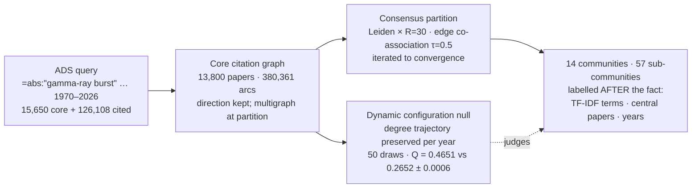
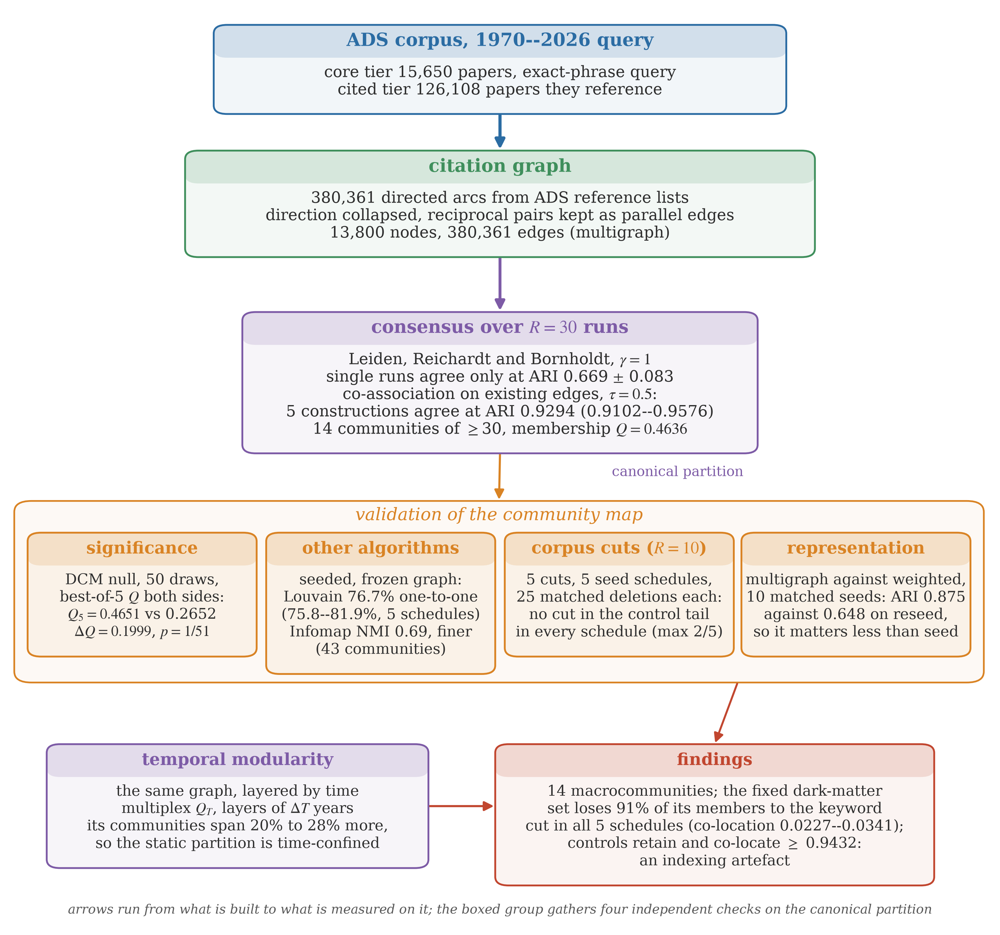
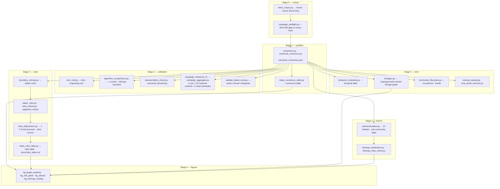

<h1 align="center">GRB Communities &amp; Evolution</h1>

<p align="center">
  
  
  
  
  
  
</p>

<p align="center">
  <b><a href="notebooks/README.md">Notebooks</a></b> ·
  <b><a href="docs/roles_table.md">Named papers</a></b> ·
  <b><a href="dossiers/">Community dossiers</a></b> ·
  <b><a href="docs/probe_lexicons.md">Probe lexicons</a></b>
</p>

**GRB Communities & Evolution** maps the structure of gamma-ray burst research
from citations alone — and then reads that structure as physics. From the
15,650 papers NASA ADS returns for 1970–2026 it builds the core citation
network, resolves it by consensus modularity into fourteen communities and
fifty-seven sub-communities, measures the role every paper plays inside and
between them, traces the lineages by which today's programmes descended from
the BATSE era, and validates each step against a null model that preserves
every paper's citation activity in every year. At the scale the map resolves, the
divisions follow **research questions rather than facilities**; the papers
that bind communities together are led by **predictive frameworks that
survived their tests**, while the **discoveries that tested them are the
strongest provincial hubs**; what crosses community boundaries is
**observables, constraints, and classifications**, while interpretive models
stay local; and programmes here fade rather than end — the one fossil is
**still cited while recruiting 0.8 papers a year**.

> Every number is produced by a script in `scripts/` from a saved product in
> `data/`, and was independently re-derived before release. The one thing the
> repository cannot ship is the ADS corpus itself (abstracts are not
> redistributable); see [Data](#data--reproducibility). A manuscript is in
> preparation.

---

## Quick look

```console
$ python3 scripts/map_summary.py
THE GRB CITATION MAP — 13,645 papers in 14 communities  (Q = 0.4636)
  C0    2126  batse, distribution, neutron, x-ray
  C1    2120  afterglow, optical, x-ray, afterglows
  C2    1999  neutron, merger, short, mergers
  C3    1674  polarization, magnetic, spectral, relativistic
  C4    1459  neutrino, neutrinos, energy, high-energy
  C5    1382  black, accretion, supernova, supernovae
  C6    1252  host, galaxies, galaxy, metallicity
  C7     754  correlation, cosmological, dark, relation
  C8     258  violation, invariance, quantum, lorentz
  C9     222  tgfs, lightning, gecam, monitor
  C10    150  fireshell, collapse, black, bdhne
  C11     88  dark, matter, annihilation, galactic
  C12     82  life, earth, ozone, solar
  C13     79  quark, strange, stars, star
roles (stable cores): 66 connector hubs · 129 provincial hubs · 7,367 peripheral
```

Thirteen of the fourteen are recognisable research programmes; C11 is an
artefact of ADS keyword indexing, which the map's own self-containment
measure catches.

## Table of contents

- [How it works](#how-it-works)
- [Architecture](#architecture)
- [The science](#the-science)
- [Running it](#running-it)
- [Data & reproducibility](#data--reproducibility)
- [Validation](#validation)
- [Repository layout](#repository-layout)
- [Citation · Authors](#citation)

## How it works

The measurement is one graph, one partition, and one null — every later
quantity is computed on them, never on a re-derived variant.



## Architecture

<p align="center">
  
</p>

<p align="center"><i>The measurement chain, from the ADS query to the findings. Single optimiser
runs agree only at ARI 0.669, so the canonical partition is taken from consensus over thirty
runs; the boxed group is the four independent checks on that partition. Every number shown is
read from the analysis products at build time (<code>scripts/fig_pipeline.py</code>) — this
diagram lives here.</i></p>

At the script level, every measurement traces to one producer and one saved
product. The notebooks run them in this order; each stage reads only what the
previous one wrote.



The rule that shaped this layout: **nothing is formatted from a rounded
intermediate.** The roles table and the strict role census are produced from
`paper_roles_fullprec.csv.gz`, not from the display-rounded master table —
a lesson bought by a real defect.

## The science

| Question | What the map answers |
|---|---|
| What organises GRB research? | Fourteen communities whose concentration pattern follows research questions rather than facilities; no facility dominates a community (largest single-facility share 40.5%); mission papers surface as connector hubs |
| Which papers bind the field? | The leading connectors are confirmed predictive frameworks (collapsar, fireball afterglow, merger triad) and instrument papers; the three strongest provincial hubs are the GW170817 discovery papers |
| What crosses community boundaries? | Observables, constraints, and classifications (Band spectrum, duration classes, the compactness constraint); interpretive models stay local — median participation 0.68 for spectral-lag papers vs 0.25 for equation-of-state papers |
| How did the structure form? | One BATSE-era heritage until the first afterglows; then thirty years of splits and mergers, two new lineages after 2000, a single 51-paper block lost in 46 years |
| What happens to programmes that stop exchanging? | Three fates, measured: a school (fireshell), a fossil (quark stars — cited, recruiting 0.8 papers/yr), an artefact (the dark-matter block) |
| What does this give the next layer? | The relation types — *predicts, confirms, constrains, classifies, anchors* — a semantic knowledge graph of the field needs, with the reading lists and role table as extraction targets |

## Running it

```bash
git clone https://github.com/vikas-chand/GRB_Communities_Evolution.git
cd GRB_Communities_Evolution
python3 -m venv .venv && source .venv/bin/activate
pip install python-igraph leidenalg infomap numpy scipy scikit-learn matplotlib jupyterlab ipykernel
python -m ipykernel install --user --name grb-venv --display-name "Python (grb-venv)"
jupyter lab                     # open notebooks/00_corpus.ipynb
```

The notebooks are **shipped executed**, so every output — including the
figures at the end of `06_figures` — is visible on GitHub without running
anything. To reproduce them, run in order. With `RUN_LONG = False` (the
default) each stage verifies the saved products and rebuilds every cheap
product, table, and figure in minutes; `RUN_LONG = True` re-derives the
expensive stages (the five-schedule campaign takes hours). Every stochastic
stage is seeded, and a cold run of the cheap path regenerates every product
content-identically to the shipped ones.

## Data & reproducibility

| Shipped | Not shipped |
|---|---|
| `data/graph/` — the 380,361 core-to-core citation arcs among 13,800 papers, with bibcode, year, first author, title, doctype per node | `data/raw/*.jsonl` — the frozen ADS corpus with abstracts (ADS terms prohibit bulk redistribution) |
| `data/raw/*_bibcodes.tsv.gz` — corpus manifests; `arxiv_primary_categories.tsv.gz` | |
| `data/communities/` — every analysis product, including the locked five-schedule campaign and control sets | |
| `dossiers/` — per-community reading dossiers, every statement anchored to a bibcode | |

Every stage that starts from the graph or from saved products runs from the
repository alone. Stages that read abstracts (TF-IDF labelling, the concept
sweep, node titles on the graph figure) need a corpus: set `ADS_API_TOKEN`
and run Stage 0 with `RUN_FETCH = True`. The result is a new corpus — the ADS
index is live — so numbers will differ from the frozen ones; the frozen
products are the record.

## Validation

The map is tested four ways before anything is built on it:

1. **Significance** — Q₅ = 0.4651 against 0.2652 ± 0.0006 under the
   degree-trajectory-preserving null; p = 1/51, the floor for fifty draws.
2. **Unrelated objectives** — Louvain matches 76.7 % of papers; Infomap,
   which shares nothing with modularity, agrees at NMI 0.69 with 89 % of
   papers nested inside their own community.
3. **Perturbation** — five predeclared seed schedules, four suspect-paper cuts,
   twenty-five matched control deletions per cut; no cut consistently
   displaces the partition; the keyword-only cut removes 80 of the 88
   dark-matter papers.
4. **Author-independent labels** — arXiv primary categories chosen by the
   authors themselves enrich nine of the fourteen communities.

Every product and figure was additionally re-derived by an independent
adversarial audit before release.

## Repository layout

```
paper/figures/ the figures the notebooks regenerate
scripts/      every producer, one file per measurement (superseded ones kept, listed in notebooks/README.md)
notebooks/    00–06: the pipeline in order, cold-run safe
data/graph/   public citation graph (nodes + arcs)
data/communities/  all products; campaign/ and control_sets/ are locked
dossiers/     per-community dossiers (C00–C13) with bibcode anchors
docs/         roles_table.md (all named papers), probe_lexicons.md (all 200 probes)
```

## Citation

Chand, V., Sharma, K., & Joshi, J. C. (2026), manuscript in preparation.
Data: NASA Astrophysics Data System.

## Authors

Vikas Chand (Louisiana State University) · Khushboo Sharma (ARIES) ·
Jagdish C. Joshi (ARIES). Built with igraph, leidenalg, Infomap, NumPy, Matplotlib.
